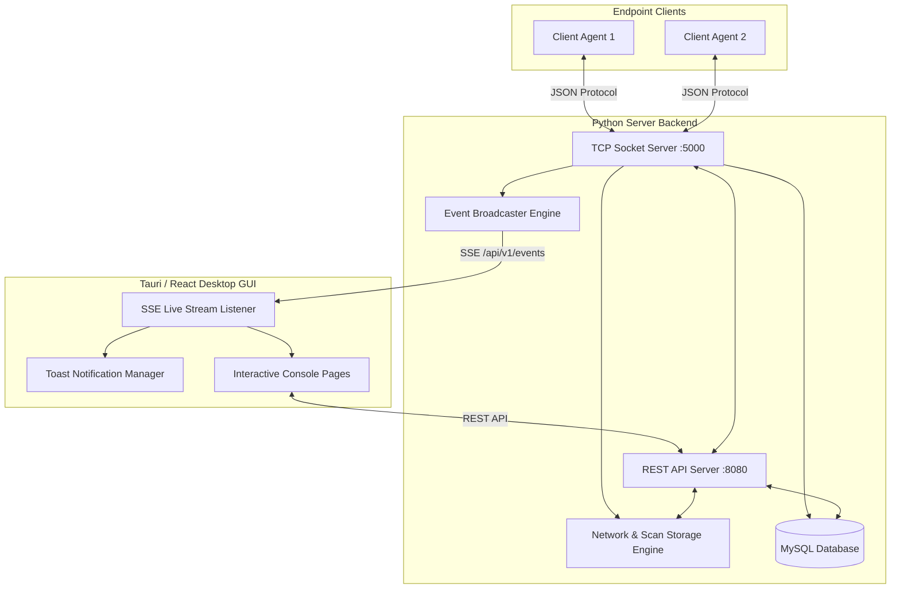

# NetWatch Monitoring Console — Application Capabilities & Progress Report

**Document Date:** August 18, 2026  
**System Architecture:** Python 3 Daemon / REST API Server + Tauri / React Desktop Management Console  

---

## 1. Executive Summary

NetWatch is an enterprise-grade network monitoring and endpoint telemetry management system. It combines a multi-threaded Python server backend with an interactive desktop graphical user interface (Tauri + React + TypeScript + CSS Design Tokens).

The application enables real-time client asset discovery, remote command orchestration, live process exploration, policy enforcement (working hours and forbidden process tracking), DHCP network observation, and instant toast notifications via Server-Sent Events (SSE).

---

## 2. System Architecture



---

## 3. Core Capabilities & Feature Catalog

### 📡 A. Server-Level Operations
* **Multi-Client TCP Hub (`server.py` & `server_lib.py`):**
  * Manages persistent TCP connections with authenticated agents.
  * Handles concurrent heartbeat frames, asynchronous alert packets, and bidirectional command queues.
* **Network Report Merging & Discovery:**
  * Aggregates client-reported neighbor discovery tables (IP, MAC, Hostname, Vendor, Latency).
  * Automatically classifies discovered devices into **Managed** (registered client agents) and **Unmanaged** devices.
  * Can be triggered on demand directly from the GUI (`POST /api/v1/network/scans`).
* **DHCP Activity Auditing:**
  * Asynchronously captures DHCP discovery, request, and acknowledgement frames.
  * Writes daily structured JSON logs for network audit trails.
* **Policy & Security Compliance Engine:**
  * **Working-Hours Monitoring:** Checks client connection times against configurable schedule policies and automatically flags out-of-hours registrations.
  * **Forbidden Process Detection:** Validates client process reports against active blacklists with associated severity ratings (`CRITICAL`, `HIGH`, `MEDIUM`, `LOW`).

---

### 💻 B. Client Remote Control & Telemetry Hub
Available directly from the interactive **Client Detail** page without touching the terminal:

| Action / Command | GUI Capability | Description |
| :--- | :--- | :--- |
| **📊 Get Processes** | Live Process Explorer | Retrieves all active processes and renders a sortable, filterable table with PID, Name, User, CPU %, and Memory %. |
| **🛑 Kill Process** | Action in Process Table | Direct one-click termination of any remote process with confirmation modal and automatic table refresh. |
| **🚀 Start Process** | Process Launcher Modal | Launches an executable or service on the remote client by path. |
| **⚡ CPU Info** | Telemetry Inspector | Fetches processor model, physical/logical core count, frequency, and real-time utilization. |
| **🧠 Memory Info** | Telemetry Inspector | Inspects total, available, used, and swap memory allocation. |
| **💾 Disk Info** | Telemetry Inspector | Analyzes partition mounts, file systems, disk space, and usage percentages. |
| **🌐 Network Info** | Telemetry Inspector | Inspects interface configurations, IP addresses, netmasks, gateways, and hardware MACs. |
| **📋 Activity Log** | Historical Log Ingest | Pulls historical client activity logs (Last 24h, 7d, 30d) and persists them in the server database. |
| **📡 Ping Test** | Latency Inspector | Tests round-trip latency and echo responsiveness to the client. |
| **🔌 Disconnect Agent** | Server Control Action | Gracefully disconnects the client agent with confirmation dialog. |

---

### ⚡ C. Real-Time Live Streaming (SSE)
* **Zero Manual Refreshing:** Powered by Server-Sent Events (`GET /api/v1/events`), the GUI maintains a resilient, auto-reconnecting stream with keep-alive pings.
* **Live Invalidation:** When alerts arrive, clients change status, or network scans complete, active pages (`Dashboard`, `Clients`, `Latest Scan`, `Alerts`, `DHCP`) update immediately in the background without losing UI focus or input state.

---

### 🔔 D. Toast Notification Framework
* **Severity Strips & Icons:** Dynamic styling for `CRITICAL` (red), `HIGH` (orange), `MEDIUM` (yellow), `LOW` / `INFO` (blue), and `SUCCESS` (green).
* **Action Buttons:** Toast alerts include direct navigation links (e.g., `"View Alert →"` to jump straight to the relevant alert detail).
* **Auto-Dismiss & Progress:** Smooth countdown progress bar with configurable timeouts (longer for critical alerts) and manual close buttons.

---

### 🖥️ E. Management Console Pages

1. **Dashboard (`/`):**
   * High-level summary metrics (Clients Online/Offline, Unread Alerts, Total Managed Assets, Network Devices).
   * Live list of online agents with direct navigation links.
   * Latest network scan summary and recent alerts feed.
2. **Clients Page (`/clients`):**
   * Searchable, filterable directory of all managed agents with status badges and OS identifiers.
3. **Client Detail Page (`/clients/:clientId`):**
   * Full remote control toolbar, process manager, telemetry inspector, connection logs, and hardware profile.
4. **Latest Scan Page (`/network/latest`):**
   * Interactive device table with IP, MAC, Hostname, Vendor, and Managed/Unmanaged categorization.
   * Prominent **"⚡ Run Scan (Merge Reports)"** action button.
5. **Scan History (`/network/history`):**
   * Archive of historical network snapshots with device counts and date filters.
6. **Device Detail (`/network/devices/:mac`):**
   * Deep-dive into specific network nodes, observations, and reporting agents.
7. **DHCP Activity (`/network/dhcp`):**
   * Time-indexed log of DHCP packets, transactions, and lease events.
8. **Alerts Page (`/alerts`):**
   * Triage view for security and compliance violations with filterable severity levels and status toggles (`NEW`, `ACKNOWLEDGED`, `RESOLVED`).
9. **Activity Logs Page (`/activity`):**
   * Client-reported audit archives with detailed timestamped event streams.
10. **Settings Page (`/settings`):**
    * Read and manage Working Hours schedules and Forbidden Process policies.

---

## 4. API Endpoints Summary

| Method | Endpoint | Description |
| :--- | :--- | :--- |
| `GET` | `/health` | API server health and status check |
| `GET` | `/api/v1/events` | SSE real-time streaming channel |
| `GET` | `/api/v1/dashboard` | Dashboard metrics and overview data |
| `GET` | `/api/v1/clients` | List all managed endpoint clients |
| `GET` | `/api/v1/clients/:id` | Detailed client record and connection history |
| `GET` | `/api/v1/clients/:id/commands` | List of supported commands for client |
| `POST` | `/api/v1/clients/:id/commands` | Execute synchronous remote command on client |
| `GET` | `/api/v1/network/scans/latest` | Retrieve latest aggregated network scan |
| `POST` | `/api/v1/network/scans` | Trigger on-demand network discovery and report merge |
| `GET` | `/api/v1/network/scans` | Paginated list of historical network scans |
| `GET` | `/api/v1/network/devices/:mac` | Network device detail and observation history |
| `GET` | `/api/v1/network/dhcp` | Filterable DHCP activity observation logs |
| `GET` | `/api/v1/alerts` | List security, compliance, and connection alerts |
| `GET` | `/api/v1/alerts/:id` | Detailed alert breakdown |
| `GET` | `/api/v1/activity-logs` | Ingested activity logs index |
| `GET` | `/api/v1/settings/working-hours` | Active working hours policy rules |
| `GET` | `/api/v1/settings/forbidden-processes` | Active forbidden process rules |

---

## 5. How to Run

### Start the Python Backend Server
```bash
cd /home/adonis/network-scanner/server
sudo .venv/bin/python3 server.py
```
* Binds TCP socket server on port `5000`.
* Binds REST API & SSE server on `http://127.0.0.1:8080`.

### Start the GUI (Tauri Desktop App or Vite Dev Server)
```bash
cd /home/adonis/network-scanner/server/gui
npm run tauri dev
# Or for standard browser preview:
npm run dev
```
