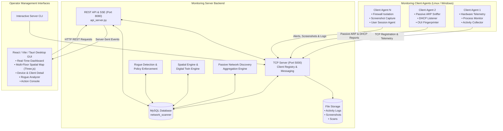
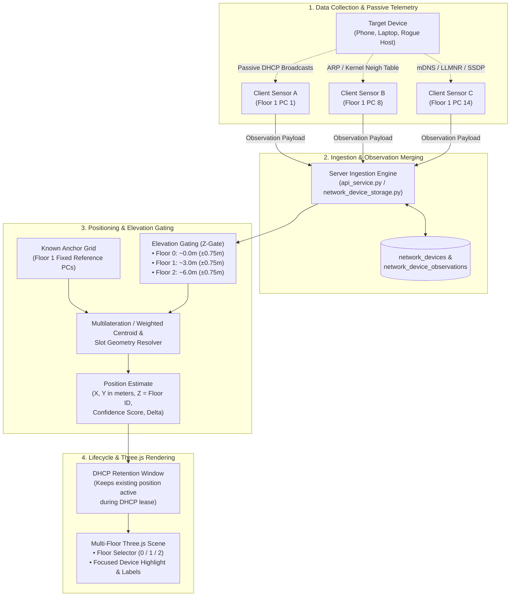

# Network Scanner & Management System

A robust, enterprise-ready Python-based network monitoring, device discovery, spatial localization, and endpoint management system with full separation between the Client agent and Server management infrastructure.

---

## Architecture Overview



---

## Project Structure

```text
network-scanner/
├── server/
│   ├── server.py                     # Primary TCP server daemon and operator CLI
│   ├── api_server.py                 # REST API (/api/v1/*) & Server-Sent Events (SSE) server
│   ├── gui_server.py                 # Web server hosting the React operator GUI
│   ├── scanner.py                    # Standalone CLI tool for aggregating client discovery reports
│   ├── database.py                   # MySQL connection pooling and schema initialization
│   ├── scripts.sql                   # Relational database schema definitions and baseline seed
│   ├── seed_center_layout.py         # Utility to seed spatial floor plan and physical locations
│   ├── inspect_localization_state.py # Diagnostic tool for localization and sensor health
│   ├── launch_gui.bat / .sh          # One-click desktop launcher scripts for the GUI
│   ├── requirements.txt              # Server dependencies (mysql-connector-python, python-dotenv)
│   ├── server_components/            # Server-side business logic and engine modules
│   │   ├── server_lib.py             # Client registry, thread-safe message queues, DB helpers
│   │   ├── action_framework.py       # Asynchronous action state machine & command definitions
│   │   ├── action_service.py         # Action dispatcher, target execution, and lifecycle tracking
│   │   ├── api_service.py            # API request handlers bridging REST endpoints to the DB
│   │   ├── calibration.py            # Coordinate calibration for spatial positioning
│   │   ├── center_layout.py          # Floor plan geometry and zone hierarchy definitions
│   │   ├── client_health.py          # CPU/RAM/Disk metrics tracking and threshold evaluator
│   │   ├── client_localization.py    # Client spatial coordinate resolution and history
│   │   ├── device_recency.py         # Active/stale device categorization and timestamps
│   │   ├── event_broadcaster.py      # Real-time Server-Sent Events (SSE) pub/sub broker
│   │   ├── floor1_spatial.py         # Authoritative multi-floor 2D world geometry & elevation gates
│   │   ├── global_network_scan.py    # Cross-client observation merger and daily scan builder
│   │   ├── location_assignment.py    # Sensor-to-location mapping and assignment logic
│   │   ├── log_storage.py            # Structured JSON filesystem activity log storage
│   │   ├── network_device_classification.py # Device role classifier (workstation, server, IoT, etc.)
│   │   ├── network_device_storage.py # Device registry and observation persistence
│   │   ├── network_discovery.py      # LAN discovery aggregation and managed/unmanaged check
│   │   ├── network_scan_storage.py   # Daily scan file indexing and storage management
│   │   ├── passive_neighbourhood_storage.py # Client neighbour table repository
│   │   ├── physical_layout.py        # Physical layout models and distance metrics
│   │   ├── physical_neighbors.py     # Topological neighbour analysis and sensor proximity
│   │   ├── screenshot_storage.py     # Screenshot image storage and metadata indexing
│   │   └── spatial_engine.py         # 2D/3D indoor trilateration and positioning calculations
│   ├── gui/                          # Modern React / TypeScript desktop console
│   │   ├── src/pages/                # Dashboard, Clients, AllDevices, RogueDevices, SpatialPage, etc.
│   │   ├── src/components/spatial/   # ThreeSpatialScene, FloorSelector, floorConfig
│   │   ├── src/components/           # Reusable UI components (AppShell, DataTable, Cards, Modals)
│   │   └── package.json              # Frontend dependencies (React, Three.js, React Three Fiber, Vite)
│   └── storage/                      # Persistent filesystem data directories
│       ├── activity_logs/            # Downloaded client activity logs
│       ├── network_scans/            # Timestamped daily aggregated network scan files
│       └── screenshots/              # Uploaded client desktop screenshots
│
├── client/
│   ├── client.py                     # Client agent entry point (TCP connection, listeners, loops)
│   ├── client_lib.py                 # Core telemetry collectors, process control, log parsers
│   ├── action_framework.py           # Client-side action execution dispatcher and validators
│   ├── process_scanner.py            # Process blacklist scanner and working hours checker
│   ├── process_monitor.py            # Scheduled background daemon for forbidden process checks
│   ├── quarantine_manager.py         # OS firewall isolation (iptables/nftables/netsh)
│   ├── network_state_manager.py      # Network interface monitoring and isolation state
│   ├── network_neighbour_collector.py# Passive ARP/neighbour cache reader and resolver
│   ├── neighbourhood.py              # Daily neighbourhood JSON state manager
│   ├── dhcp_listener.py              # Scapy-based passive DHCP traffic sniffer
│   ├── passive_protocol_listener.py  # mDNS, LLMNR, NetBIOS, SSDP broadcast listener
│   ├── oui.py                        # IEEE OUI MAC vendor database lookup
│   ├── fingerprinting.py             # Passive heuristic device and OS fingerprinting
│   ├── device_model.py               # Data models for discovered network devices
│   ├── screenshot_manager.py         # Multi-monitor desktop screenshot capture and compression
│   ├── service.py                    # Windows Service wrapper for machine-wide execution
│   ├── user_agent.py                 # Per-user interactive session companion agent
│   ├── install_user_logon_task.ps1   # PowerShell installer for Windows per-user logon task
│   ├── uninstall_user_logon_task.ps1 # PowerShell uninstaller for Windows logon task
│   ├── stop_windows_client.ps1       # PowerShell utility to terminate running Windows client instances
│   ├── requirements.txt              # Client dependencies (psutil, scapy, pillow, mss, python-dotenv)
│   └── data/ieee/                    # IEEE MAC manufacturer databases (MAL, MAM, MAS registries)
│
├── .gitignore
└── README.md
```

---

## Server Functionalities

The server acts as the centralized coordinator, database repository, spatial computation engine, and administrative API for the entire network.

### 1. TCP Server & Client Connection Management (`server.py`, `server_lib.py`)
- **Connection Lifecycle**: Maintains concurrent TCP sockets with client agents, performing continuous heartbeats and reachability checks.
- **Client Registration**: Authenticates incoming agents via a structured `REGISTER` payload (validating MAC, IP, hostname, OS details, and agent role).
- **Graceful & Abrupt Disconnect Detection**: Distinguishes between clean client disconnects and unexpected drops using configurable two-packet ping verification (`DISCONNECT_PING_DELAY_SECONDS` and `DISCONNECT_PING_TIMEOUT_SECONDS`).
- **Interactive Operator CLI**: Built-in interactive command-line interface allowing administrators to inspect connected clients, issue remote commands, view system telemetry, and trigger discovery aggregations.

### 2. REST API & Real-Time Event Streaming (`api_server.py`, `event_broadcaster.py`)
- **RESTful API (`/api/v1/*`)**: Complete HTTP REST interface conforming to the API specification with standard data/error envelopes, pagination cursors, and CORS headers.
- **Server-Sent Events (SSE) (`/api/v1/events`)**: Push-based real-time event stream providing live updates for client connection states, new alerts, rogue device detections, action status transitions, and health updates.
- **Comprehensive Endpoint Catalog**:
  - `GET /api/v1/dashboard`: Live overview of online clients, alert tallies, daily DHCP events, and scan summaries.
  - `GET /api/v1/clients` & `/api/v1/clients/{id}`: Detailed client agent inventory, connection logs, and hardware stats.
  - `GET /api/v1/devices` & `/api/v1/devices/{id}`: Comprehensive network device registry with observation history.
  - `GET /api/v1/rogue-devices`: Real-time rogue device detection feeds with risk scores and classification details.
  - `GET /api/v1/spatial/floor/{floor_id}`: Authoritative 2D/3D spatial map for Floor 0, Floor 1, or Floor 2 with active devices, reference PCs, and room geometry.
  - `GET /api/v1/locations`: Complete spatial layouts and physical location hierarchy.
  - `GET /api/v1/alerts` & `PATCH /api/v1/alerts/{id}`: Security alert triage, acknowledgment, and resolution workflows.
  - `GET /api/v1/policies/*` & `POST /api/v1/policies/*`: Security policies (forbidden process lists, working hour schedules).
  - `POST /api/v1/actions` & `GET /api/v1/actions/{id}`: Remote command dispatching with target tracking.
  - `GET /api/v1/screenshots`: Screenshot gallery and download endpoints.
  - `GET /api/v1/network-scans`: Daily discovery report retrieval and historic scan downloads.

### 3. Spatial Localization & Multi-Floor Visualization Engine (`floor1_spatial.py`, `spatial_engine.py`, `client_localization.py`, `ThreeSpatialScene.tsx`)
- **Multi-Floor Three.js Architecture**:
  - **Floor 0 (Ground Floor)**: Minimal open level with boundary grid for ground-level devices ($Z=0$).
  - **Floor 1 (Training Floor 1 / Reference Frame)**: Reference scene with Formation Rooms 1 & 2, stairs, table clusters, and fixed Reference PCs ($Z=1$).
  - **Floor 2 (Training Floor 2)**: Upper level with Formation Rooms 1 & 2 positioned at identical relative coordinates and stairs ($Z=2$).
  - **Single Shared WebGL Lifecycle**: Reusable Three.js Canvas and WebGL renderer that dynamically switches floor scenes without page reloads or memory leaks.
  - **Selective Label Focusing**: When a device is selected, its 3D marker is highlighted with an emissive glow and white ring, while non-selected device labels are hidden to maintain visual clarity.
  - **External UI Floor Selector**: Segmented control `[ Floor 0 ] [ Floor 1 ] [ Floor 2 ]` outside the 3D canvas with floor-scoped device filtering.

---

### How Device Location is Gathered & Positioned

The system uses a **multi-stage, zero-intrusion spatial pipeline** that combines passive network telemetry from distributed client sensors with a known physical layout and multilateration algorithms:



#### Step-by-Step Location Pipeline:

1. **Distributed Passive Telemetry Collection**:
   - **Client Sensors as Probes**: Managed client PCs running `client.py` act as passive listening stations across the building.
   - **Zero-Intrusion ARP Snooping**: Clients periodically read the OS kernel neighbour table (`/proc/net/arp`, `ip neigh`, `arp -a`) to discover active IP/MAC entries without generating active network traffic.
   - **Passive DHCP Packet Sniffing**: Using Scapy, clients capture broadcast `DHCPDISCOVER`, `DHCPREQUEST`, `DHCPINFORM`, and `DHCPACK` packets, identifying devices the moment they connect or renew their leases.
   - **Multicast & Name Resolution Listener**: Clients sniff mDNS, LLMNR, NetBIOS, and SSDP broadcasts to collect hostnames, vendors, and service advertisements.

2. **Fixed Reference Anchors (`reference_client`)**:
   - On Floor 1, managed workstations are assigned to specific physical coordinates $(X, Y)$ based on aisle, table number, column, and seat position (e.g., Table 1 at $X=10.0\text{m}, Y=9.0\text{m}$).
   - These workstations form an authoritative physical reference grid against which surrounding devices are measured.

3. **Floor Assignment & Elevation Gating ($Z$)**:
   - Each floor has a target physical elevation ($0.0\text{m}$ for Floor 0, $3.0\text{m}$ for Floor 1, $6.0\text{m}$ for Floor 2) with a strict tolerance gate ($\pm 0.75\text{m}$).
   - The $Z$ coordinate is preserved strictly as the floor identifier ($0, 1, 2$), preventing cross-floor bleeding.

4. **2D Coordinate Estimation $(X, Y)$**:
   - When multiple reference stations report seeing a target device, the spatial engine calculates the device's coordinates $(X, Y)$ using multilateration and distance estimation.
   - For slot-assigned or near-anchor devices, the physical slot geometry converts table and row indices into exact world coordinates in meters (e.g. within the $12\text{m} \times 27\text{m}$ physical boundary with a $5\text{m}$ center aisle).
   - Computes a confidence metric ($0.0 - 1.0$) and elevation delta ($\Delta Z$).

5. **DHCP Retention & Stale Device Filtering**:
   - An active window filter (default 5–30 minutes) ensures disconnected devices are gracefully removed.
   - Recent DHCP observations allow an existing valid position estimate to be retained throughout the lease grace window without fabricating new coordinates.

6. **Three.js Multi-Floor Rendering**:
   - The frontend queries `GET /api/v1/spatial/floor/{floor_id}`.
   - Translates metric $(X, Y)$ coordinates into the Three.js horizontal ground plane `[x - width/2, 0, height/2 - y]`.
   - Renders interactive markers (normal/DHCP/rogue), allowing operators to click any device to focus its label and inspect details in real time.

---

### 4. Security, Policy & Rogue Device Detection (`network_device_classification.py`, `action_service.py`)
- **Rogue Device Analyzer**: Continuously assesses unmanaged network entities discovered by clients. Evaluates risk scores based on vendor verification, unauthorized IP ranges, activity during off-hours, and unknown MAC addresses.
- **Forbidden Process Governance**: Enforces centralized blacklists of unauthorized executables (e.g. gaming apps, unauthorized torrent/mining tools) and distributes rules to clients.
- **Working Hours Policy**: Validates client activity against authorized operating schedules (e.g., standard business hours), generating security alerts upon off-hours activity.
- **Alert Triage System**: Triages security events into `LOW`, `MEDIUM`, `HIGH`, and `CRITICAL` severities with full incident audit trails.

### 5. Remote Action Framework (`action_framework.py`, `action_service.py`)
- **Targeted Command Execution**: Dispatches asynchronous commands to individual clients, groups of devices, or entire network zones.
- **State Machine**: Tracks command progression (`PENDING` $\rightarrow$ `RUNNING` $\rightarrow$ `COMPLETED` / `FAILED` / `TIMED_OUT`) with detailed execution results and error logs.
- **Action Capabilities**: Supports remote process termination, executable launching, network quarantine isolation, power control (reboot/shutdown), diagnostic collection, and on-demand screenshot capture.

### 6. Passive LAN Discovery Aggregator (`global_network_scan.py`, `network_discovery.py`, `scanner.py`)
- **Zero-Intrusion Discovery**: Aggregates passive neighbour and DHCP observations transmitted by distributed client agents without sending active ARP sweeps, ping storms, or Nmap scans from the server.
- **Device Classification**: Automatically correlates discovered MAC addresses against registered client agents, classifying devices into `MANAGED`, `UNMANAGED`, and `UNKNOWN`.
- **Daily Scan Audit Logs**: Compiles and indexes daily discovery snapshots into `server/storage/network_scans/network_scan_YYYY-MM-DD.json`.

### 7. Modern Management Console GUI (`server/gui/`, `gui_server.py`)
- **Single Page Application**: Built with React, TypeScript, Vite, and Tailwind CSS.
- **Interactive Pages**:
  - **Dashboard**: Real-time KPI cards, health dials, active alerts, and recent network events.
  - **Clients**: Client fleet management with live status badges, IP/MAC search, and action modals.
  - **All Devices**: Global network inventory with vendor filtering and observation history.
  - **Rogue Devices**: Security console highlighting high-risk unmanaged devices with one-click quarantine.
  - **Spatial Map**: Multi-floor Three.js spatial view with Floor 0, Floor 1, Floor 2 scenes, floor switcher, and label focus.
  - **Activity Logs**: Searchable audit log viewer for browser history, shell commands, and file accesses.
  - **Alerts**: Centralized security notification console with acknowledgment and resolution filters.
  - **Settings & Policies**: Interactive editors for forbidden processes and working hour schedules.

---

## Client Functionalities

The client agent runs on managed endpoints (Linux and Windows), operating either as a background system daemon, a per-user interactive agent, or a combined unified client.

### 1. Endpoint Identity & Telemetry (`client_lib.py`, `client.py`)
- **Hardware & Identity Reporting**: Discovers active network interface IP, hardware MAC address (matching the active outbound route), hostname, and OS kernel/architecture.
- **Resource Monitoring**:
  - **CPU**: Brand model, physical/logical core count, total utilization percentage, and per-core utilization.
  - **Memory**: Total, available, used RAM, and usage percentages.
  - **Disk**: Partition mountpoints, total storage capacity, free space, and disk usage percentages.
- **Health Telemetry Updates**: Periodically streams system health metrics to the server for dashboard monitoring.

### 2. Process Control & Governance (`process_scanner.py`, `process_monitor.py`)
- **Active Process Enumeration**: Lists all running processes with PID, executable name, username, CPU usage, and memory consumption.
- **Remote Process Control**: Allows authorized operators to terminate offending processes (`KILL_PROCESS`) or launch approved administrative tools (`START_PROCESS`).
- **Policy Enforcement Daemon**: Periodically scans running processes against the server-defined forbidden processes policy. Automatically notifies the server and logs security alerts when unauthorized software is launched.

### 3. Forensic Activity Logging (`client_lib.py`)
- **Browser History Collection**: Extracts browsing history across user profiles with configurable lookback windows (`1h`, `1d`, `7d`, `30d`):
  - Google Chrome & Chromium-based browsers (Edge, Brave, Opera, Vivaldi)
  - Mozilla Firefox
  - Apple Safari
- **Terminal & Shell History**: Extracts command execution history from `~/.bash_history`, `~/.zsh_history`, and PowerShell history.
- **Recent File Access**: Identifies recently created or modified files in user profile directories.

### 4. Passive Network Discovery & Traffic Sniffing (`network_neighbour_collector.py`, `dhcp_listener.py`, `passive_protocol_listener.py`)
- **ARP/Neighbour Cache Extraction**: Reads the operating system's kernel neighbour table (`/proc/net/arp`, `ip neigh`, `arp -a`) to discover active LAN hosts with zero network noise.
- **Passive DHCP Interception**: Uses Scapy packet sniffing on local network interfaces to intercept DHCP `DISCOVER`, `REQUEST`, `INFORM`, and `ACK` packets, capturing new devices joining the subnet in real time.
- **Multicast & Broadcast Listening**: Passively listens for mDNS (Bonjour), LLMNR, NetBIOS Name Service, and SSDP traffic to discover local hostnames and services.
- **Local Daily Snapshots**: Persists daily neighbour observations in local JSON state files (`network_scan_YYYY-MM-DD.json`) before synchronizing with the server.

### 5. Device Fingerprinting & OUI Vendor Identification (`oui.py`, `fingerprinting.py`, `device_model.py`)
- **IEEE OUI Lookup**: Identifies device hardware manufacturers by matching MAC prefixes against local IEEE OUI registries (MAL, MAM, MAS).
- **Heuristic Classification**: Analyzes hostnames, open broadcast services, and DHCP request parameters to categorize endpoints (e.g. Workstation, Server, Mobile, Printer, Network Appliance).

### 6. Network Quarantine & Device Isolation (`quarantine_manager.py`, `network_state_manager.py`)
- **Host-Level Quarantine**: Implements strict firewall rules to instantly isolate compromised or rogue endpoints:
  - **Linux**: Uses `iptables` / `nftables` chains to block all inbound and outbound traffic while maintaining an exception for the server TCP port.
  - **Windows**: Uses Windows Firewall rules via `netsh advfirewall` to isolate the host.
- **Quarantine Release**: Gracefully restores default firewall rules when an administrator releases the quarantine.

### 7. Interactive Desktop Screenshot Capture (`screenshot_manager.py`, `user_agent.py`)
- **Multi-Display Screen Capture**: Captures full-resolution desktop screenshots from the active user session using `mss` and `Pillow`.
- **Image Optimization & Compression**: Automatically scales and compresses captured images to adhere to payload limits while preserving visual clarity.
- **Base64 Payload Streaming**: Encodes screenshots for direct transmission to the server and storage in `server/storage/screenshots/`.

### 8. Windows Deployment & Service Support (`service.py`, `user_agent.py`, PowerShell Scripts)
- **Combined Session Mode**: Runs as a unified client handling both background system commands and interactive desktop actions (screenshots, user activity logs).
- **Logon Scheduled Task**: Automated PowerShell script (`install_user_logon_task.ps1`) configures a Windows Scheduled Task executing `user_agent.py` at user login under interactive privileges without storing plaintext credentials.
- **Clean Service Management**: Helper scripts (`stop_windows_client.ps1`, `uninstall_user_logon_task.ps1`) ensure graceful termination and clean uninstallation.

---

## Supported Remote Commands & Actions

| Command | Category | Description | Parameters |
| :--- | :--- | :--- | :--- |
| `GET_SYSTEM_INFO` | Telemetry | Retrieve IP, MAC, hostname, and OS release/version | None |
| `GET_NETWORK_INFO` | Telemetry | Retrieve all network adapters, IP addresses, netmasks | None |
| `GET_CPU_INFO` | Telemetry | Retrieve CPU model, physical/logical cores, utilization % | None |
| `GET_MEMORY_INFO` | Telemetry | Retrieve RAM capacity, used memory, and free memory | None |
| `GET_DISK_INFO` | Telemetry | Retrieve storage partitions, total/free disk space | None |
| `GET_PROCESSES` | Process | Retrieve table of currently active processes and PIDs | None |
| `START_PROCESS` | Process | Launch an application or binary on the client | `{"path": "<command_or_path>"}` |
| `KILL_PROCESS` | Process | Terminate a running process by name | `{"process_name": "<name>"}` |
| `GET_ACTIVITY_LOG` | Forensics | Collect browser history, shell commands, file activity | `{"period": "1h" \| "1d" \| "7d" \| "30d"}` |
| `SCREENSHOT` | Forensics | Capture current desktop screens of the logged-in user | `{"device_name": "<label>"}` |
| `REFRESH_HEALTH` | Telemetry | Force an immediate CPU, memory, and disk health refresh | None |
| `COLLECT_DIAGNOSTICS` | Diagnostics | Collect comprehensive hardware, network, and error diagnostics | None |
| `QUARANTINE_CLIENT` | Security | Isolate the client endpoint at the firewall level | `{"reason": "<explanation>"}` |
| `RELEASE_CLIENT` | Security | Remove firewall isolation and restore normal network access | None |
| `GET_QUARANTINE_STATUS`| Security | Check if client firewall quarantine is currently active | None |
| `ISOLATE_DEVICE` | Security | Disconnect or isolate a network interface | `{"interface": "<name>"}` |
| `SHUTDOWN` | Power | Gracefully power off the client operating system | `{"delay_seconds": 10}` |
| `RESTART` | Power | Gracefully reboot the client operating system | `{"delay_seconds": 10}` |
| `UPDATE_LOCATION` | Spatial | Update the physical location metadata assigned to the client | `{"location_id": 12, "coordinates": [x,y,z]}` |
| `UPDATE_FORBIDDEN_PROCESS_POLICY` | Policy | Sync updated forbidden process rules to the client | `{"forbidden_processes": [...]}` |
| `PING` | Connectivity | Test round-trip latency and connection health | None |
| `DISCONNECT` | Lifecycle | Gracefully terminate client connection | None |

---

## Server Setup & Configuration

### 1. Prerequisites
- **Python 3.9+**
- **MySQL Server 8.0+**
- **Node.js 18+** (for building/running the operator GUI)

### 2. Environment Configuration
Create or configure `server/.env`:

| Variable | Default Value | Description |
| :--- | :--- | :--- |
| `DB_HOST` | `localhost` | MySQL hostname or IP address |
| `DB_PORT` | `3306` | MySQL service port |
| `DB_NAME` | `network_scanner` | Database name |
| `DB_USER` | `scanner` | Database user |
| `DB_PASSWORD` | `scanner_password` | Database password |
| `SERVER_HOST` | `0.0.0.0` | IP to bind the TCP listener |
| `SERVER_PORT` | `5000` | Port for the TCP listener |
| `API_HOST` | `0.0.0.0` | Bind IP for the REST API |
| `API_PORT` | `8080` | Port for the REST API |
| `GUI_HOST` | `127.0.0.1` | Bind IP for the static GUI server |
| `GUI_PORT` | `8080` | Port for the static GUI server |
| `NETWORK_SCAN_STORAGE_DIR` | `server/storage/network_scans` | Storage path for daily scan JSON files |
| `NETWORK_CLIENT_OBSERVATION_MAX_AGE_SECONDS` | `3600` | Age threshold for client ARP observations in aggregated scans |
| `LOG_LEVEL` | `INFO` | Logging threshold (`DEBUG`, `INFO`, `WARNING`, `ERROR`) |

### 3. Installation & Startup

```bash
# Navigate to server folder
cd server

# Create and activate virtual environment
python3 -m venv .venv
source .venv/bin/activate  # On Windows: .venv\Scripts\activate

# Install dependencies
pip install -r requirements.txt

# Start the TCP monitoring server & REST API
python server.py
```

### 4. Running the Operator GUI

To run the web console:
```bash
# Start the GUI server
python server/gui_server.py
```
Open `http://127.0.0.1:8080` in your web browser.

To run the development frontend with hot reloading:
```bash
cd server/gui
npm install
npm run dev
```

---

## Client Setup & Configuration

### 1. Prerequisites
- **Python 3.9+**
- **Npcap** (Windows only — required for passive DHCP packet sniffing)
- Standard root/administrator privileges (required for firewall quarantine and packet sniffing)

### 2. Environment Configuration
Create or configure `client/.env`:

| Variable | Default Value | Description |
| :--- | :--- | :--- |
| `SERVER_IP` | `127.0.0.1` | IP address of the monitoring server |
| `SERVER_PORT` | `5000` | Port of the monitoring server |
| `NETWORK_NEIGHBOUR_HOSTNAME_LOOKUP_LIMIT` | `64` | Maximum neighbour hostnames resolved per report |
| `NETWORK_OUI_DATABASE` | detected local files | Custom path to IEEE OUI CSV database |
| `DHCP_LISTEN_INTERFACE` | system default | Interface for passive DHCP capture |
| `FORBIDDEN_PROCESS_SCAN_INTERVAL_SECONDS` | `600` | Interval between scheduled forbidden process checks |

### 3. Standard Client Execution (Linux / macOS / Windows)

```bash
# Navigate to client directory
cd client

# Create and activate virtual environment
python3 -m venv .venv
source .venv/bin/activate  # On Windows: .venv\Scripts\activate

# Install dependencies
pip install -r requirements.txt

# Run client agent
python client.py
```

### 4. Windows User-Session Logon Task Installation

For full desktop screenshot and user activity logging support on Windows:

```powershell
# Open PowerShell in client folder
cd client

# Install the per-user scheduled task
.\install_user_logon_task.ps1
```

To remove the logon task:
```powershell
.\uninstall_user_logon_task.ps1
```

