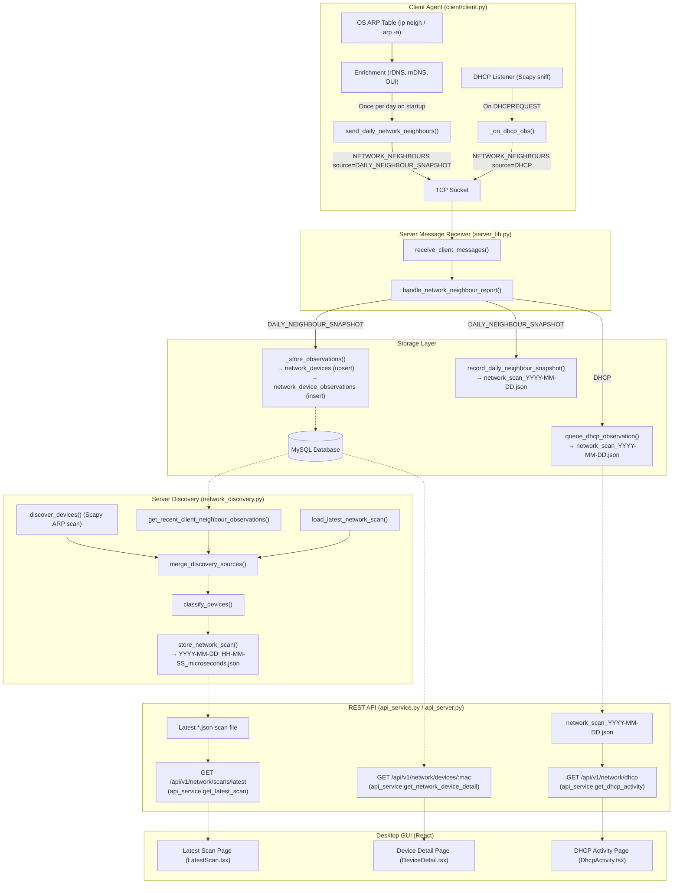

# Codebase Audit Report: Network Discovery & Architecture

An in-depth audit of the entire codebase was conducted across all discovery sources, data flows, storage formats, DHCP enrichment, client commands, and GUI bindings.

---

## A. Current Discovery Sources

| Source | Platform | Active / Passive | Data Collected | Destination |
| :--- | :--- | :--- | :--- | :--- |
| **Client OS Neighbour Table**<br>`(NetworkNeighbourCollector)` | Linux (`ip -j neigh`), Windows (`arp -a`), macOS (`arp -an`) | Passive (kernel cache lookup) | IP, MAC, state (dynamic/static), interface, hostname (DNS/mDNS), OUI vendor | Sent via TCP frame `NETWORK_NEIGHBOURS` with `observation_source = DAILY_NEIGHBOUR_SNAPSHOT` |
| **Client DHCP Listener**<br>`(DHCPListener)` | Cross-platform (Scapy BPF sniff on UDP port 67/68, fallback to UDP socket) | Passive (broadcast packet capture) | MAC, requested IP, hostname (Option 12), vendor class (Option 60), client ID (Option 61), DHCP message type | Sent via TCP frame `NETWORK_NEIGHBOURS` with `observation_source = DHCP` |
| **Server Active ARP Scan**<br>`(run_active_scan)` | Linux / Root (`scapy.srp` with Ether/ARP) | Active (raw ARP broadcast probe) | IP, MAC, hostname (rDNS/mDNS), OUI vendor, optional Nmap OS fingerprint | Saved as timestamped scan JSON file `YYYY-MM-DD_HH-MM-SS_microseconds.json` |
| **Server Report Aggregator**<br>`(run_manual_scan)` | Server / In-process | Passive (database & file merge) | Aggregates DB observations from reporting clients and previous scan snapshot | Saved as timestamped scan JSON file `YYYY-MM-DD_HH-MM-SS_microseconds.json` |

---

## B. Current Device Flow & Architecture Diagram



---

## C. Scan File Analysis (Two JSON Formats)

In `server/storage/network_scans/`, two distinct file formats exist:

### 1. `YYYY-MM-DD_HH-MM-SS_microseconds.json` (e.g. `2026-08-19_09-11-31_299482.json`)

* **Created by:** `network_scan_storage.py:167-186` called during `network_discovery.py:634-678` or `network_discovery.py:680-739`.
* **Payload Structure:**

```json
{
  "completed_at": "2026-08-19T09:11:31.299482+00:00",
  "network": {
    "interface": "client-reported",
    "local_ip": null,
    "network": "client-reported",
    "gateway": null
  },
  "devices_found": 111,
  "devices": [
    {
      "ip_address": "172.16.4.41",
      "mac_address": "90:61:AE:CF:35:F0",
      "hostname": null,
      "vendor": "Intel Corporate",
      "observation_sources": [...],
      "classification": "UNMANAGED",
      "is_managed": false
    }
  ]
}
```

* **Purpose:** Point-in-time snapshot of the LAN discovery state. This file directly backs the **Latest Network Scan** and **Scan History** views in the GUI.

---

### 2. `network_scan_YYYY-MM-DD.json` (e.g. `network_scan_2026-08-19.json`)

* **Created/Updated by:** `network_scan_storage.py:140-165` and `network_scan_storage.py:121-138`.
* **Payload Structure:**

```json
{
  "date": "2026-08-19",
  "dhcp_observations": [
    {
      "received_at": "2026-08-19T10:02:26.096415+01:00",
      "reporting_client_mac": "E4:FD:45:BA:8B:96",
      "neighbours": [
        {
          "ip_address": "172.16.0.102",
          "mac_address": "E4:FD:45:BA:8B:96",
          "entry_type": "dynamic",
          "hostname": "DESKTOP-DJP05CM"
        }
      ],
      "dhcp": {
        "message_type": 3,
        "vendor_class": "MSFT 5.0",
        "client_id": "01:E4:FD:45:BA:8B:96"
      }
    }
  ],
  "neighbour_snapshots": {
    "E4:FD:45:BA:8B:96": {
      "received_at": "...",
      "neighbours": [...]
    }
  }
}
```

* **Purpose:** A daily audit log of all captured DHCP requests and client daily neighbour snapshots. Backs the **DHCP Activity** page in the GUI.
* **Conclusion:** These files represent Option C: One is a point-in-time discovery snapshot, and the other is a daily audit log. Both have legitimate roles, but DHCP data was isolated exclusively to the daily audit log and never reached device records.

---

## D. DHCP Integration Status & Minimal Fix

### The Root Cause

1. **In `server_lib.py:923-937`:**
   When a client reports a DHCP observation (`observation_source == "DHCP"`), the server only called `queue_dhcp_observation()`, writing to `network_scan_YYYY-MM-DD.json`.

2. **It never called `network_device_storage.py:181-195`:**
   As a result:
   * MySQL table `network_devices` was never upserted with the DHCP hostname or IP.
   * MySQL table `network_device_observations` received no `CLIENT_DHCP` observation row.

3. **Missing from Discovery Snapshots:**
   Because `network_discovery.py:634-678` and `network_discovery.py:680-739` build their scans by querying `network_device_observations` (`source_type = 'CLIENT_ARP'`), DHCP-discovered hostnames/IPs never made it into the scan snapshots or the GUI device list.


## Current_progress:

### Step 1 Completed: DHCP Enrichment & Device Data Flow Integration

  #### Summary of Changes 
  
  1. Client-Side DHCP Enrichment (client.py):
      • When client.py:252-305 captures a live DHCP packet, it now also performs local IEEE OUI vendor lookup (oui.get_vendor()) so that the emitted NETWORK_NEIGHBOURS message contains the MAC,
      requested IP, DHCP hostname (Option 12), OUI vendor, and DHCP options.
  2. Server-Side DHCP Ingestion & Storage (server_lib.py & network_device_storage.py):   
      • Implemented network_device_storage.py:200-213 in network_device_storage.py.
      • Updated server_lib.py:923-937 in server_lib.py: when observation_source == "DHCP", it now upserts the device into MySQL network_devices (enriching hostname and IP address keyed by        
      mac_address) and records a CLIENT_DHCP observation in network_device_observations, in addition to maintaining the daily JSON audit log in network_scan_YYYY-MM-DD.json.
      • Updated network_device_storage.py:275-345 to load both CLIENT_ARP and CLIENT_DHCP observations and preserve source_type. 
  3. Discovery Merging with DHCP Hostnames (network_discovery.py):
      • Updated network_discovery.py:538-630 to preserve CLIENT_DHCP observation sources and ensure DHCP-provided hostnames enrich the device records across scans without creating duplicate      
      devices.
  4. API Service DHCP Population (api_service.py):
      • Updated api_service.py:515-589 to dynamically report all observation sources (CLIENT_ARP, CLIENT_DHCP, SERVER_SCAN) and populate dhcp_observations.
  5. Test Suite Verification:
      • Added unit tests test_network_device_storage.py:307-338 and test_network_discovery.py:269-305.
      • Ran all 68 tests across client/tests and server/tests — 100% passing.

  ──────
### Step 2 Completed: Add Active ARP Scanning to Clients

  #### Summary of Changes

  1. Dynamic Subnet & Interface Detection (`client/network_neighbour_collector.py`):
      • Implemented `get_local_network()` which dynamically queries Linux `ip route` and `ip addr` (with `psutil`/socket fallback for cross-platform support).
      • Fully dynamic subnet calculation without hard-coding any IP ranges.
  2. Client-Side Active ARP Probing (`client/network_neighbour_collector.py`):
      • Implemented `discover_active_arp()` using Scapy `srp(Ether()/ARP())` with safe fallback on missing permissions/dependencies.
  3. MAC-Based Deduplication & Merging (`client/network_neighbour_collector.py`):
      • Implemented `merge_neighbours_by_mac()` to combine passive OS neighbour table entries and active ARP probe results by MAC address without duplicate records.
  4. Integration in Daily Snapshot Reporting (`client/client.py`):
      • `send_daily_network_neighbours()` now calls `NetworkNeighbourCollector().collect(enrich=True, active_scan=True)`.
  5. Test Suite Verification (`client/tests/test_network_neighbour_collector.py`):
      • Added 4 dedicated tests covering subnet detection, Scapy response normalization, MAC merging, and end-to-end active collection.
      • Ran all 72 tests across client/tests and server/tests — 100% passing.

  ──────
  ──────
### Step 3 & Step 4 Completed: Verification & Clean Removal of Redundant "Get Network Log" Action

  #### Summary of Changes

  1. UI & Endpoint Trace Verification:
      • Verified how network devices appear across `GET /api/v1/network/scans/latest`, `GET /api/v1/network/scans`, and `GET /api/v1/network/devices/:mac`.
      • Confirmed that devices are deduplicated by MAC address across all 4 discovery sources (Server active ARP, Client OS neighbour table, Client active ARP, DHCP listener).
      • Confirmed hostname, vendor, IP, and observation source merging semantics.
  2. Removal of Obsolete `GET_NETWORK_LOG` Action:
      • `server/gui/src/pages/ClientDetail.tsx`: Removed redundant "📜 Network Log" button from the client actions UI.
      • `server/api_server.py`: Removed `GET_NETWORK_LOG` entry from `/api/v1/clients/:id/commands` API endpoint response.
      • `server/server_components/server_lib.py`: Removed "10. Network connection log" from CLI `client_menu` and re-indexed menu commands.
      • Documentation (`README.md`, `APP_CAPABILITIES_AND_PROGRESS.md`): Cleaned up obsolete references to `GET_NETWORK_LOG`.
  3. Frontend & Test Suite Verification:
      • Fixed unused React import in `server/gui/src/components/AppShell.tsx`.
      • Verified frontend build: `npm run build` (`tsc && vite build`) passed with 0 errors.
      • Verified backend and client test suite: All 72 tests in `server/tests` and `client/tests` passed (100% passing).
      • Final Verification Checklist: All 16 checklist items in `NETWORK_DISCOVERY_VERIFICATION_PLAN.md` verified and completed.