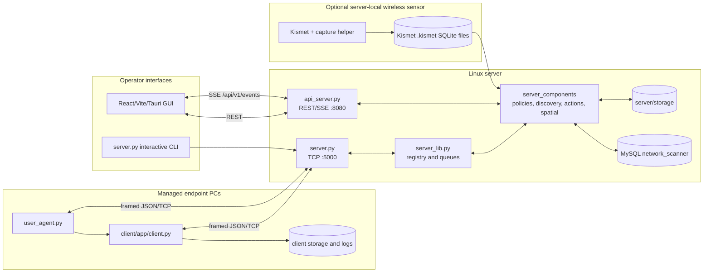

# System Architecture

## 1. Purpose and boundaries

Network Scanner is a centralized monitoring and endpoint-management system.
The server owns the client registry, database, API, event stream, discovery
merge, spatial model, policy state, action lifecycle, package repository, and
optional wireless investigation source. Clients collect local telemetry and
passive network observations, enforce client-side policies, and execute
registered server commands.

The system deliberately separates three boundaries:

| Boundary | Responsibility | Primary transport |
| --- | --- | --- |
| Endpoint client | Local collection, enforcement, screenshots, and command execution | Outbound framed JSON/TCP |
| Server backend | Registry, persistence, merging, policies, actions, API, and orchestration | MySQL, filesystem, TCP, HTTP/SSE |
| Operator console | Views, filters, actions, spatial visualization, and live notifications | REST and SSE |

Kismet is a fourth, optional server-local source. It writes SQLite capture files
on the Linux sensor; the server reads those files for bounded wireless
investigation queries. Capture databases are not copied to endpoint clients.

## 2. Runtime topology

## 3. Processes and startup

### Server backend

`server/server.py` initializes the database, opens the TCP listener, starts
background workers, starts the REST API, and then either opens the operator
menu or waits in supervisor mode. `SERVER_INTERACTIVE=false` is used by
`network-scanner-server.service.example` so systemd can keep the server/API
alive after boot.

### Client agent

`client/app/client.py` loads client configuration, starts the local monitors,
connects to `SERVER_IP:SERVER_PORT`, registers the endpoint, starts heartbeats,
and reconnects after transport failure. `client/client.py` and
`client/user_agent.py` are compatibility launchers that import the app under
`client/app/`.

The interactive user-session launcher is important for browser activity and
screenshot access. A Windows service runs under a different account/profile;
do not run both launch modes for the same endpoint unless a deliberate
multi-role deployment has been designed.

### Kismet sensor

`kismet-sensor.service` runs Kismet as the non-login `kismet` account with
`CAP_NET_ADMIN` and `CAP_NET_RAW`, creates the monitor interface, writes to the
configured capture root, and recreates the interface on restart. The current
host profile uses `wlp0s20f3` as the managed interface and
`wlp0s20f3mon` as the monitor interface.

## 4. Main data flows

### Client registration and heartbeat

1. The client opens an outbound TCP connection.
2. It sends a `REGISTER` frame containing identity, platform, version, and
   `agent_role`.
3. The server validates and registers the client in its in-memory registry and
   database.
4. The server sends initial policy/configuration responses.
5. The client sends periodic `HEARTBEAT` frames and asynchronous alerts,
   telemetry, activity, and observation reports.
6. The server tracks connections and emits live events for the GUI.

### Discovery and observations

Client neighbour-table, DHCP, and passive protocol observations are normalized
locally and sent as framed reports. The server stores device identity and
observation provenance in MySQL, maintains daily JSON audit files, and merges
reports into scan snapshots. See
[Discovery and observations](functionalities/discovery-and-observations.md).

### Remote actions

The GUI creates an action through REST. The server persists the action and
targets, dispatches a command over the registered client connection, tracks
the result, and broadcasts lifecycle updates. Package deployment adds a
chunked, hash-verified transport and may restart the client.

### Live console updates

The GUI reads initial data using REST and subscribes to `/api/v1/events` for
connection, alert, action, scan, telemetry, and health changes. React pages
invalidate or refresh only the affected resource rather than polling every
page continuously.

## 5. Trust and storage boundaries

- MySQL is server-local by default; endpoint clients never receive database
  credentials.
- Endpoint clients make outbound TCP connections; they do not need inbound
  firewall openings.
- Kismet HTTP and the application API are localhost-only in the approved host
  profile. Remote access should use an authenticated private proxy or tunnel,
  not an open public listener.
- Client configuration is outside the replaceable `client/app/` tree so an
  update package cannot overwrite machine-specific server settings.
- Update packages are staged, validated, hash-checked, backed up, and rolled
  back on failure.

## 6. Important current limitations

- The API is intentionally a local operator API and does not replace a full
  identity-aware reverse proxy. Do not expose it directly to the Internet.
- Spatial accuracy depends on configured locations, reference clients, fresh
  observations, and calibration quality.
- Client-side active ARP code remains for compatibility/future work, but the
  normal neighbourhood workflow is passive neighbour/DHCP collection.
- Kismet retention is dry-run by default. A dedicated persistent mount remains
  the migration requirement for a future Linux sensor.
passive network observations, enforce client-side policies, and execute
registered server commands.
