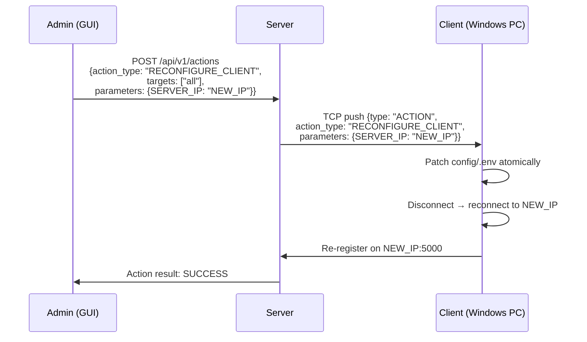

# Server Migration Feature

## Goal Description

When the project moves from the current development PC to the center's production server machine, two things must happen:

1. **Server side** — a new machine needs to be set up correctly: all configuration paths, credentials, systemd services, and Kismet sensor settings must be adapted to the new environment. No universal migration script exists today; the install docs exist but they reference `adonis`-specific paths.

2. **Client side** — every installed client (currently ~24 Windows PCs) has a `config/.env` file with `SERVER_IP=172.16.x.x`. When the server IP changes, that value must change on every machine. Manually touching 24 files is not acceptable. The existing `UPDATE_CLIENT` + updater mechanism (which replaces `app/`) is **not suitable** because `config/.env` is deliberately kept outside `app/` so updates never overwrite it.

The solution has two parts:
- A new **`RECONFIGURE_CLIENT`** action: the server pushes a config patch (key-value pairs) to each client over the existing TCP channel; the client atomically rewrites the relevant keys in its `config/.env` and reconnects with the new settings — no manual file touching, no ZIP package required.
- A **server migration runbook** (`docs/general/operations/server-migration.md`) that captures every server-side step needed to move to a new machine, replacing scattered `home/adonis` references with portable instructions.

---

## Architecture Overview



---

## User Review Required

> [!IMPORTANT]
> The `RECONFIGURE_CLIENT` action patches `config/.env` in-place. It **only writes keys listed in `parameters`**; all other keys are left untouched. A partial write failure rolls back to the original file via a `.tmp` + `os.replace()` swap.

> [!IMPORTANT]
> After patching `SERVER_IP`, the client must reconnect — which means it will **disconnect from the current server** before reconnecting to the new one. During the migration window the old server should still be running (or the new one should be up at the new IP). We recommend: bring the new server up → broadcast `RECONFIGURE_CLIENT` → decommission the old server.

> [!WARNING]
> `RECONFIGURE_CLIENT` should be restricted to a safe allowlist of keys that clients are permitted to accept from the server. Allowing the server to write arbitrary env keys would be a security issue. The initial allowlist is: `SERVER_IP`, `SERVER_PORT`. Optional future additions: `NETWORK_SCAN_INTERFACE`, `NETWORK_SCAN_SUBNET`.

---

## Open Questions

> [!IMPORTANT]
> **Reconnect behavior**: After patching `SERVER_IP`, should the client:
> - (A) Immediately disconnect and reconnect (live, no restart required) — simpler, but mid-session disruption.
> - (B) Restart the client process (schedule a relaunch via the OS task/service) — cleaner, but takes longer.
>
> **Recommended: (A)** — the client already has retry/reconnect logic. It can close the socket and loop back to connect with the new IP without restarting the process.

> [!IMPORTANT]
> **Scope of `RECONFIGURE_CLIENT`**: For now, do you want to support only `SERVER_IP`/`SERVER_PORT`, or also arbitrary optional config keys like `NETWORK_SCAN_INTERFACE`? Keeping the allowlist tight is safer for the first version.

---

## Proposed Changes

### Component 1 — Server: New ActionType + API + Bulk dispatch

---

#### [MODIFY] `server/server_components/action_framework.py`

Add `RECONFIGURE_CLIENT` to the `ActionType` enum:

```python
# After UPDATE_CLIENT:
RECONFIGURE_CLIENT = "RECONFIGURE_CLIENT"
```

---

#### [MODIFY] `server/server_components/server_lib.py` (or whichever file handles action dispatch to clients)

The `RECONFIGURE_CLIENT` action is dispatched exactly like `UPDATE_CLIENT` — it is pushed over the existing TCP socket to the target client(s). No new transport layer needed.

The action payload sent to the client:
```json
{
  "type": "ACTION",
  "action_id": "act-abc123",
  "action_type": "RECONFIGURE_CLIENT",
  "parameters": {
    "SERVER_IP": "10.0.0.5"
  }
}
```

---

#### [MODIFY] `server/api_server.py`

Add `RECONFIGURE_CLIENT` to the list of allowed action types in the `/api/v1/actions` POST handler (it uses the ActionType enum already, so adding the enum value is sufficient).

Optionally expose a dedicated convenience endpoint:
```
POST /api/v1/actions/reconfigure-server-ip
Body: { "new_ip": "10.0.0.5", "new_port": 5000 }
```
This auto-targets all connected clients. Can be wired to a GUI button later.

---

### Component 2 — Client: Handle `RECONFIGURE_CLIENT` action

---

#### [MODIFY] `client/app/action_framework.py`

Add `RECONFIGURE_CLIENT` to the client-side `ActionType` enum (mirrors server):
```python
RECONFIGURE_CLIENT = "RECONFIGURE_CLIENT"
```

---

#### [MODIFY] `client/app/client_lib.py`

Add a handler registered with the `ActionDispatcher` for `RECONFIGURE_CLIENT`:

```python
# Allowlist of keys the server is permitted to change remotely
_RECONFIGURE_ALLOWLIST = {"SERVER_IP", "SERVER_PORT"}

def _handle_reconfigure_client(message, *, client_root, conn, **_context):
    """Patch config/.env with the server-supplied key-value pairs, then reconnect."""
    parameters = message.get("parameters") or {}
    
    # 1. Validate — only allowlisted keys
    rejected = {k for k in parameters if k not in _RECONFIGURE_ALLOWLIST}
    if rejected:
        return {"status": "FAILED", "error": f"Rejected disallowed keys: {rejected}"}
    if not parameters:
        return {"status": "FAILED", "error": "No parameters provided"}
    
    env_path = client_root / "config" / ".env"
    
    # 2. Read existing env file
    existing = {}
    if env_path.is_file():
        for line in env_path.read_text(encoding="utf-8").splitlines():
            line = line.strip()
            if line and not line.startswith("#") and "=" in line:
                k, _, v = line.partition("=")
                existing[k.strip()] = v.strip()
    
    # 3. Apply patch
    existing.update(parameters)
    
    # 4. Write atomically
    new_content = "\n".join(f"{k}={v}" for k, v in existing.items()) + "\n"
    tmp_path = env_path.with_suffix(".tmp")
    try:
        tmp_path.write_text(new_content, encoding="utf-8")
        os.replace(tmp_path, env_path)
    except OSError as err:
        return {"status": "FAILED", "error": f"Could not write config: {err}"}
    
    # 5. Signal reconnect (set a flag that the main connection loop checks)
    _request_reconnect()   # details below
    
    return {"status": "SUCCESS", "patched_keys": list(parameters.keys())}
```

**Reconnect mechanism**: The client's main connection loop already retries on disconnect. We add a module-level `threading.Event` called `_reconnect_requested`. When set, the connection loop closes the current socket and re-reads `SERVER_IP`/`SERVER_PORT` from env (by calling `os.getenv` again after `load_dotenv`), then reconnects. The new IP takes effect within seconds, no process restart needed.

```python
_reconnect_requested = threading.Event()

def _request_reconnect():
    _reconnect_requested.set()
```

In the connection loop (in `client.py`), after closing the socket on any disconnect/error:
```python
if _reconnect_requested.is_set():
    _reconnect_requested.clear()
    load_dotenv(CONFIG_DIR / ".env", override=True)
    SERVER_IP = os.getenv("SERVER_IP", "127.0.0.1")
    SERVER_PORT = int(os.getenv("SERVER_PORT", "5000"))
```

---

### Component 3 — GUI: Migration panel / button

---

#### [MODIFY] `server/gui/src/pages/Settings.tsx` (or a new `ServerMigration.tsx`)

A simple form in the settings page (or a dedicated "Migration" section in the admin panel):

```
New Server IP:   [ 10.0.0.5          ]
New Server Port: [ 5000              ]
Target clients:  [ All connected ▼  ]

[ Broadcast Reconfigure ]
```

Clicking "Broadcast Reconfigure" calls:
```
POST /api/v1/actions
{
  "action_type": "RECONFIGURE_CLIENT",
  "targets": ["all"],        // or specific client IDs
  "parameters": { "SERVER_IP": "10.0.0.5", "SERVER_PORT": "5000" }
}
```

The existing actions table in the GUI already shows progress per client.

---

### Component 4 — Server `.env`: Portability fixes

The server `.env` currently has three `home/adonis`-specific absolute paths. These need to become portable so a new admin on a new machine doesn't have to hunt them down:

---

#### [MODIFY] `server/.env` + documentation

| Current | Portable replacement | Notes |
|---|---|---|
| `KISMET_CAPTURE_ROOT="/home/adonis/kismet"` | `KISMET_CAPTURE_ROOT="~/kismet"` or document as "must match output dir in kismet_site.conf" | `~` expands via `Path.expanduser()` |
| `KISMET_CONF_DIR="/home/adonis/kismet/conf"` | `KISMET_CONF_DIR="~/kismet/conf"` | Same |
| `NETWORK_SCAN_STORAGE_DIR="/home/adonis/network-scanner/server/storage/network_scans"` | Already set; document as "absolute path relative to the server's install location" | ✅ already fixed in previous session |

In `server/server_components/kismet_service.py` (and any other file that reads these env vars), ensure they are passed through `Path(value).expanduser()` so `~/kismet` works correctly.

---

#### [MODIFY] `network-scanner-server.service.example`

Currently hardcodes `User=adonis`, `WorkingDirectory=/home/adonis/...`. Change comments to make it clear these must be replaced:

```ini
# Replace 'adonis' with the actual username on the target machine.
User=adonis
Group=adonis
WorkingDirectory=/home/adonis/network-scanner/server
EnvironmentFile=-/home/adonis/network-scanner/server/.env
ExecStart=/home/adonis/network-scanner/server/.venv/bin/python /home/adonis/network-scanner/server/server.py
```

A helper `scripts/install_server_service.sh` can substitute `$HOME` automatically:
```bash
#!/bin/bash
# Usage: sudo bash scripts/install_server_service.sh
sed "s|/home/adonis|$HOME|g; s|User=adonis|User=$USER|g; s|Group=adonis|Group=$USER|g" \
  network-scanner-server.service.example \
  | sudo tee /etc/systemd/system/network-scanner-server.service > /dev/null
sudo systemctl daemon-reload
echo "Service installed. Run: sudo systemctl enable --now network-scanner-server.service"
```

---

### Component 5 — Migration Runbook

---

#### [NEW] `docs/general/operations/server-migration.md`

A step-by-step guide for moving to a new server machine, covering:

1. **Pre-migration checklist** — what data to export (MySQL dump, `server/storage/`, observation files from `~/kismet/`, trained ML models, etc.)
2. **New server setup** — adapted `server/.env` (with `$HOME`-relative paths), venv, MySQL schema, service install via `install_server_service.sh`
3. **Kismet sensor reconfiguration** — interface names, capture root, conf dir, systemd service
4. **Broadcasting the new IP to all clients** — using the new `RECONFIGURE_CLIENT` action from the GUI
5. **Verification** — check all clients reconnect, alerts fire, Kismet intervals resume
6. **Decommissioning the old server**

---

## Verification Plan

### Automated Tests

```bash
# Run existing action framework tests
cd /home/adonis/network-scanner/server
.venv/bin/pytest tests/test_action_framework.py tests/test_update_client.py -v

# New: client-side reconfigure handler unit test
cd /home/adonis/network-scanner/client
.venv/bin/pytest tests/test_reconfigure_client.py -v
```

### Manual Verification

1. **Config patch**: Trigger `RECONFIGURE_CLIENT` from the GUI targeting one test client. Check that `client/config/.env` on that machine now shows the new `SERVER_IP`. Old keys are preserved.
2. **Reconnect**: Confirm the client disconnects and reconnects to the new IP without restarting the Python process (check PID stays the same in Task Manager).
3. **Bulk**: Trigger on all clients simultaneously. Confirm all clients show `SUCCESS` in the actions table within ~30 seconds.
4. **Rollback safety**: Send a `RECONFIGURE_CLIENT` with an invalid/disallowed key. Confirm the client returns `FAILED` and `config/.env` is unchanged.
5. **Server portability**: Verify `~/kismet` expands correctly on the new machine (check `KISMET_CAPTURE_ROOT` loads with `expanduser()`).
6. **Service install script**: Run `scripts/install_server_service.sh` and confirm it generates the correct service file with the right username/path.
